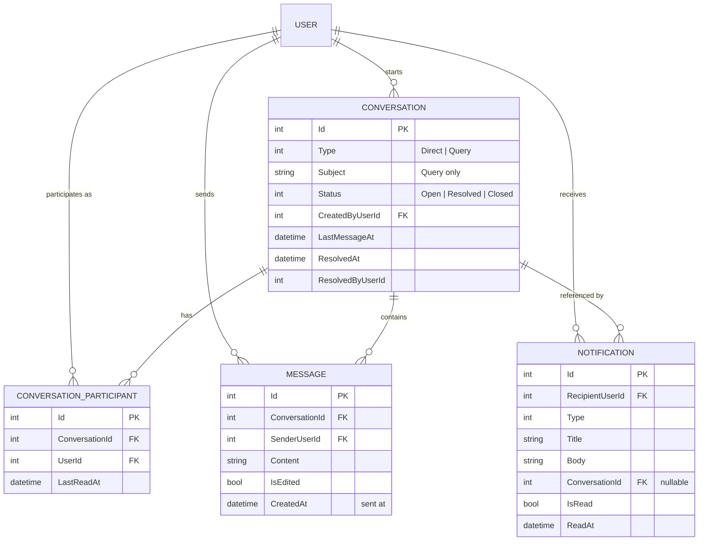
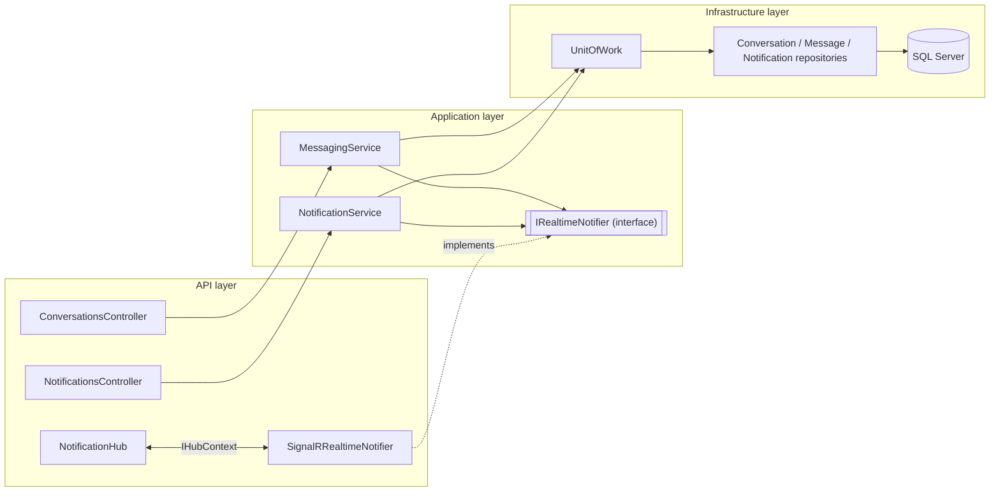
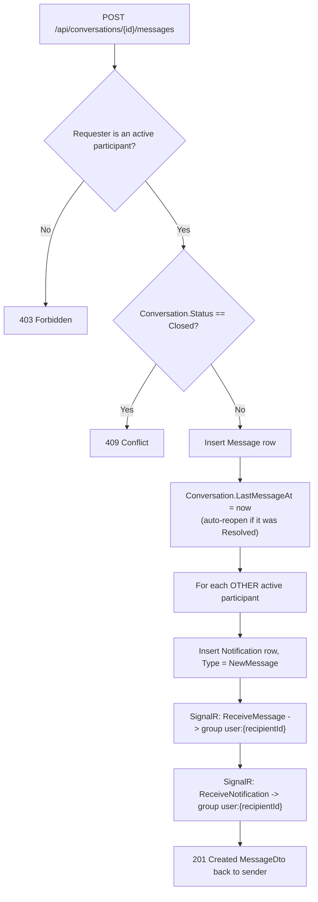
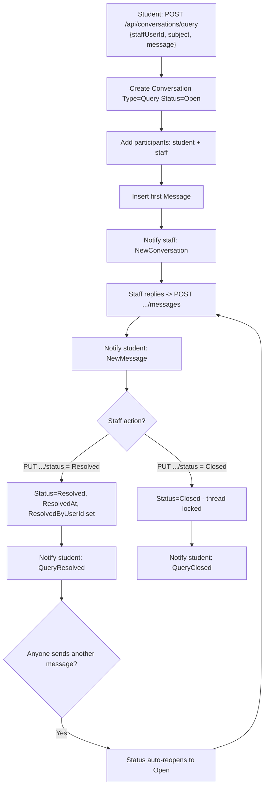
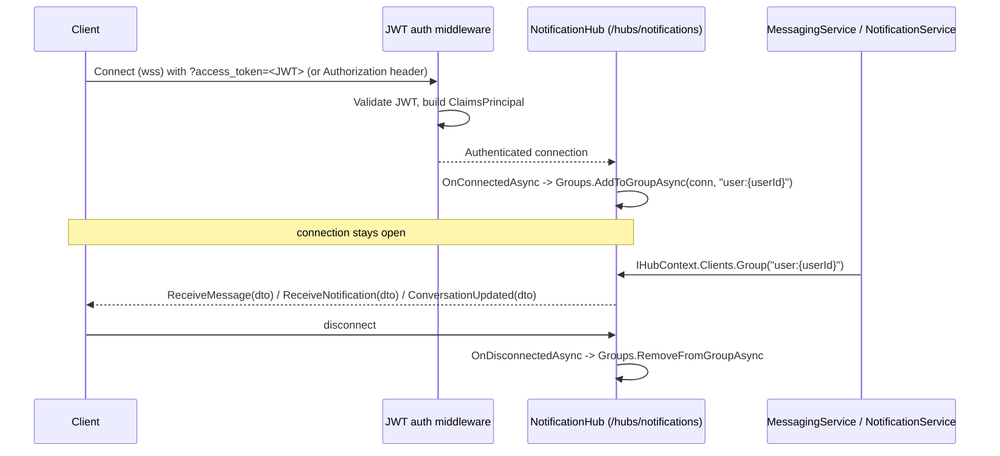

# Messaging & Notification System — Design

Status: **Implemented** (backend). Companion doc for the `Conversation` / `Message` / `Notification` feature set added to the API.

## 1. Goal

Give staff and students a way to communicate directly inside the school system instead of over external channels, and give everyone a single place to see what needs their attention:

- **Staff ↔ Staff** — direct 1:1 messaging.
- **Staff ↔ Student** — direct 1:1 messaging, *and* a structured **Query** thread a student can raise (e.g. "doubt in Chapter 4") that a staff member can resolve/close.
- **Student ↔ Student** — intentionally **not** supported.
- A **Notification** feed (in-app, real-time) that fires whenever something needs a user's attention — a new message, a new conversation, a query being resolved.

## 2. Conversation rules

| Initiator | Can start with | Conversation type |
|---|---|---|
| Staff | Staff or Student | `Direct` |
| Student | Staff only | `Direct` or `Query` |
| Student | Student | ❌ blocked by `MessagingService` |

- Starting a second `Direct` conversation with the same person **reuses the existing one** instead of creating a duplicate thread.
- `Query` conversations carry a `Subject` and a `Status` (`Open → Resolved → Closed`) so a doubt/discussion has a visible lifecycle. `Direct` conversations don't use status (always effectively open).
- Sending a message into a `Resolved` query automatically flips it back to `Open` (the discussion isn't over just because a reply arrived). `Closed` is terminal — only staff can close, and closed threads reject new messages.

## 3. Data model

All four entities inherit `BaseEntity` (`Id`, `CreatedAt`, `UpdatedAt`, `IsActive`) like every other entity in this codebase, so soft-delete/audit comes for free — no separate `SentAt`/`IsDeleted` fields needed.

## 4. Where it lives (Clean Architecture)

`IRealtimeNotifier` is declared in Application (so the services stay transport-agnostic) but implemented in the API project, because `Infrastructure` is a plain class library with no ASP.NET Core hosting reference — the SignalR `Hub`/`IHubContext` types only make sense where the web host lives. This mirrors how `IJwtTokenService` is declared in Application and implemented in Infrastructure: interface near the consumer, implementation near the capability.

## 5. Flow: sending a message

## 6. Flow: a student query, end to end

## 7. Flow: real-time delivery (SignalR)

Connections are grouped **per user, not per conversation** — the server already knows a conversation's participants from the database, so it just fans the event out to each recipient's `user:{userId}` group. This also means a user signed in on two devices gets the event on both, with no extra bookkeeping.

If a client is offline, the `Notification` row is still there waiting in `GET /api/notifications` — SignalR is a push accelerator on top of the durable notification feed, not a replacement for it.

## 8. REST API

| Method | Route | Roles | Notes |
|---|---|---|---|
| GET | `/api/conversations/contacts` | Staff, Student | Who you're allowed to message (role-filtered) |
| POST | `/api/conversations/direct` | Staff, Student | Start or reuse a 1:1 conversation |
| POST | `/api/conversations/query` | Student | Raise a query thread with a staff member |
| GET | `/api/conversations` | Staff, Student | My conversations, newest activity first, with unread counts |
| GET | `/api/conversations/{id}` | participant only | Conversation detail |
| GET | `/api/conversations/{id}/messages?page=&pageSize=` | participant only | Paginated history, oldest→newest per page |
| POST | `/api/conversations/{id}/messages` | participant only | Send a message |
| PUT | `/api/conversations/{id}/read` | participant only | Marks `LastReadAt = now` for the caller |
| PUT | `/api/conversations/{id}/status` | Staff, participant only | Query only: `Open` \| `Resolved` \| `Closed` |
| GET | `/api/notifications?unreadOnly=&page=&pageSize=` | Staff, Student | My notification feed |
| GET | `/api/notifications/unread-count` | Staff, Student | Badge count |
| PUT | `/api/notifications/{id}/read` | owner only | Mark one read |
| PUT | `/api/notifications/read-all` | Staff, Student | Mark everything read |

## 9. SignalR contract

- Hub path: `/hubs/notifications`, `[Authorize]`, same JWT bearer scheme as REST.
- Browsers can't set an `Authorization` header on a WebSocket handshake, so the JWT bearer handler also accepts the token via `?access_token=` on requests under `/hubs/`.

| Event (server → client) | Payload | Fired when |
|---|---|---|
| `ReceiveMessage` | `MessageDto` | A new message lands in a conversation you're in |
| `ReceiveNotification` | `NotificationDto` | Any notification is created for you |
| `ConversationUpdated` | `ConversationDto` | A query's status changes |

No client → server hub methods are needed for the MVP; all writes go through the REST endpoints and the hub is push-only.

## 10. Notification triggers

| Type | Trigger | Recipient(s) |
|---|---|---|
| `NewConversation` | A `Direct` or `Query` conversation is started | The other participant |
| `NewMessage` | A message is posted | Every other active participant |
| `QueryResolved` | Staff sets a query to `Resolved` | The student |
| `QueryClosed` | Staff sets a query to `Closed` | The student |

## 11. Authorization matrix

| Action | Staff | Student |
|---|---|---|
| Message another staff member | ✅ | — |
| Message a student | ✅ | — |
| Message a staff member | ✅ | ✅ |
| Message another student | — | ❌ |
| Raise a `Query` | — | ✅ |
| Resolve / close a `Query` | ✅ (if a participant) | ❌ |
| Read/send in a conversation | only if a participant | only if a participant |

Every conversation/message/notification endpoint re-checks participant membership server-side in `MessagingService`/`NotificationService` — the `[Authorize(Roles=...)]` attributes on controllers only gate the coarse role, not per-record ownership.

## 12. Out of scope for this pass

- File/image attachments (would need an actual storage backend — none exists in this repo yet).
- Email/SMS/push-notification delivery (in-app + SignalR only).
- Group chats beyond the 1:1 conversation model.
- Typing indicators / read receipts beyond "conversation marked read".
- Wiring the existing (in-progress, uncommitted) `Announcement` feature into `NotificationService` — natural next step once `AnnouncementService` exists, using the same `INotificationService.CreateAsync` used here.
